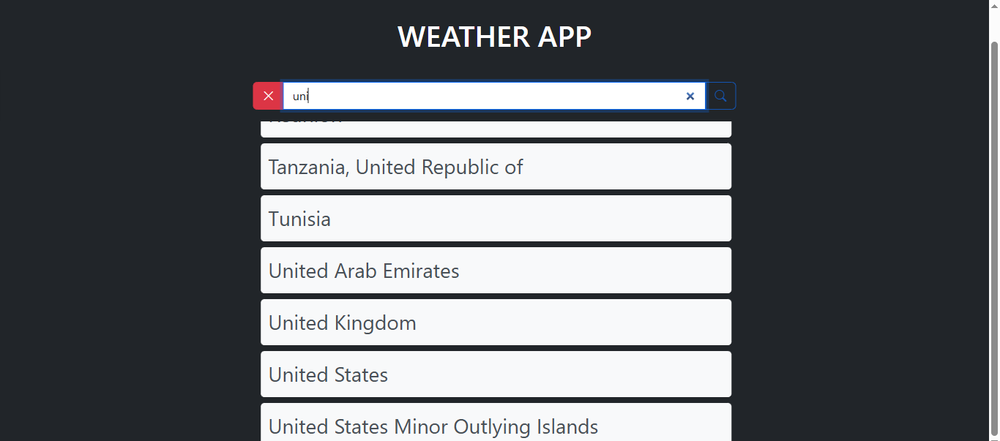

## Installation

```
$ git clone https://github.com/aqibaMalik/Weather-App
$ cd Weather-App
```

## App Configuration

Get Your Weather API KEY here: https://www.weatherapi.com/

⚠️ **Important Instructions** ⚠️:

- Create `.env` file in root of the project.
- Write the key you got from above url. _eg_  API_Key = <your_apikey>

```
$ npm install
$ npm start/your script
```

## Preview



## **Developed with ❣️ By Aqib Malik**
